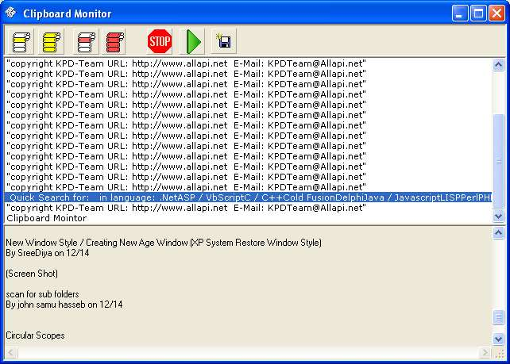



## Clipboard Mointor

### Description

Clipboard Monitor, catches whatever text you copy to the clipboard in any program and present all these texts in a list, where u can copy any or all of them or save to a textfile.

The Clipboard Hook code module is "Copyright KPD-Team URL: http://www.allapi.net E-Mail: KPDTeam@Allapi.net"

The rest is mine ;-)
 
### More Info
 

             |
---                |---
**Submitted On**   |2004-12-14 05:07:38
**By**             |[M\. J\. Highlander](https://github.com/Planet-Source-Code/PSCIndex/blob/master/ByAuthor/m-j-highlander.md)
**Level**          |Intermediate
**User Rating**    |4.9 (64 globes from 13 users)
**Compatibility**  |VB 6\.0
**Category**       |[Complete Applications](https://github.com/Planet-Source-Code/PSCIndex/blob/master/ByCategory/complete-applications__1-27.md)
**World**          |[Visual Basic](https://github.com/Planet-Source-Code/PSCIndex/blob/master/ByWorld/visual-basic.md)
**Archive File**   |[Clipboard\_18294512142004\.zip](https://github.com/Planet-Source-Code/m-j-highlander-clipboard-mointor__1-57727/archive/master.zip)

